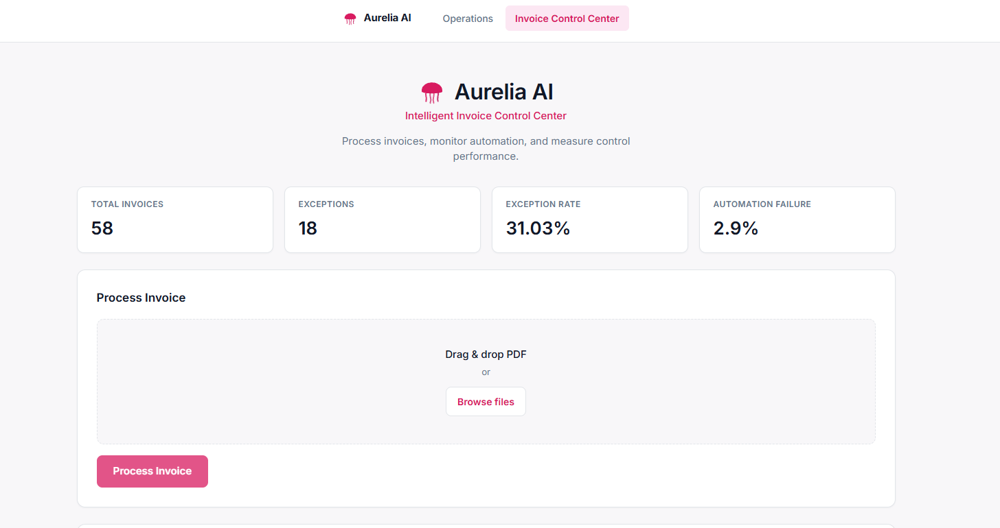
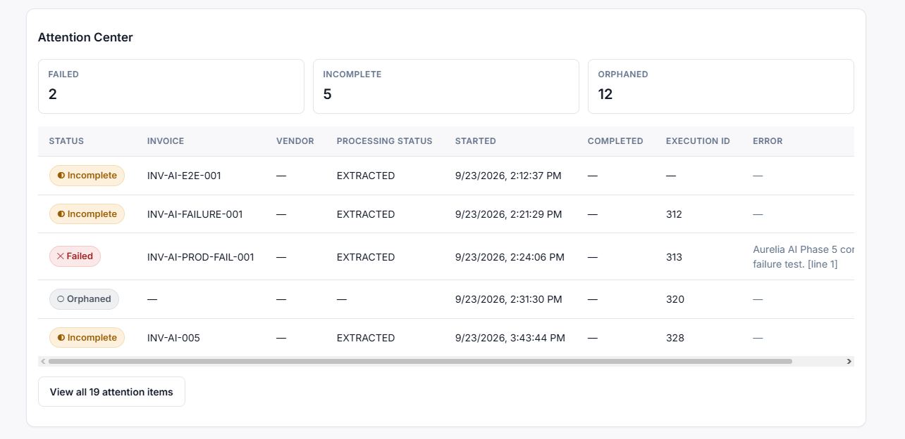
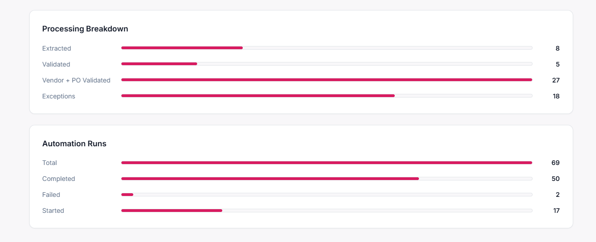
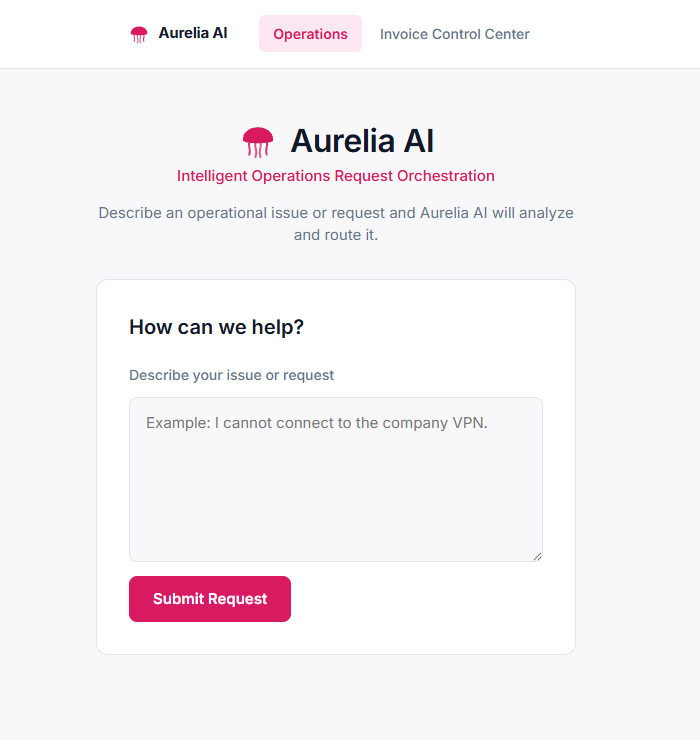
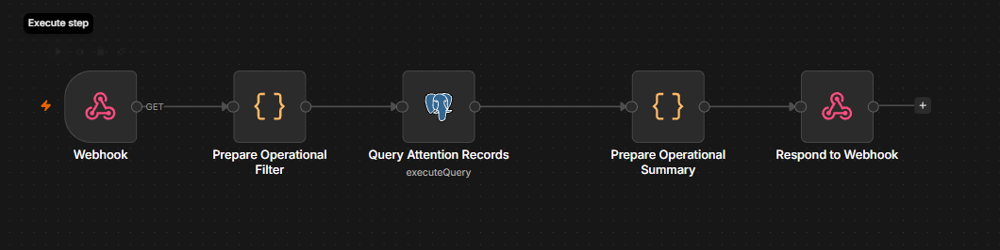
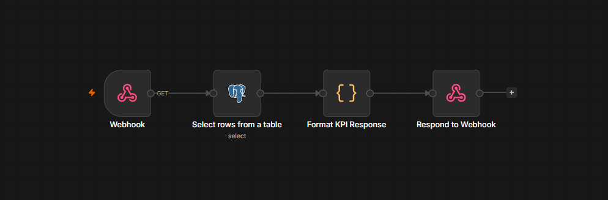

# Aurelia AI — Intelligent Invoice Control Center

Aurelia AI is a portfolio project that demonstrates an AI-assisted invoice
control workflow. It combines PDF text extraction, structured AI extraction,
deterministic business validation, duplicate detection, exception handling,
automation auditing, and operational monitoring into one operator-facing
application.


*The unified Aurelia AI Invoice Control Center: live KPI strip (Total
Invoices, Exceptions, Exception Rate, Automation Failure) above the
Process Invoice panel, where a PDF is uploaded and submitted for
processing.*

This repository contains the **React frontend**. The n8n workflow,
PostgreSQL database, and local Ollama model that power the automation are
maintained separately and are not included in this repository (see
[Local Setup](#local-setup)).

## Overview

**The business problem:** manual invoice processing typically involves
reading a document, verifying the vendor, checking the invoice against an
approved purchase order, watching for duplicates, and flagging anything
that doesn't line up — repetitive work that still requires judgment calls
when something looks wrong.

**The solution Aurelia AI demonstrates:** automate the repetitive parts
while keeping the important decisions deterministic and auditable.

- **AI-assisted extraction** — a local language model reads the invoice
  document and extracts structured fields (vendor, invoice number, amount,
  currency, dates, PO number) from unstructured text.
- **Deterministic business controls** — the extracted data is then checked
  against reference data (vendors, purchase orders) and fixed business
  rules (amount limits, currency matching, duplicate detection) inside the
  n8n workflow. The AI does not decide whether an invoice passes or fails;
  the workflow's deterministic rules do.

This is a demo/portfolio system built on synthetic data. It is not
connected to a real ERP or accounting system, and no production deployment
or real-world accuracy claim is made.

## How It Works

```
PDF or text invoice
        ↓
   n8n webhook
        ↓
  Document text extraction
        ↓
  AI structured extraction (Ollama / Qwen)
        ↓
  PostgreSQL reference lookups (vendor, PO)
        ↓
  Deterministic validation (amount, currency, status)
        ↓
  Duplicate detection
        ↓
  Automation audit trail
        ↓
  Structured response → React frontend
```

The implemented frontend currently submits invoices as a **PDF file
upload**. The workflow is designed around text-based PDF extraction, so
the "text extraction" step above is n8n reading the PDF's text layer, not
OCR of a scanned image.

## Automation Architecture


*The n8n automation workflow behind `POST /webhook/invoice-control` —
PDF extraction, AI field extraction, vendor/PO validation, duplicate
detection, and audit persistence, orchestrated end to end. This is the
backend automation graph, not the web application shown above.*

At a high level, the n8n workflow behind `POST /webhook/invoice-control`
does the following:

```
Webhook (PDF upload)
   → Prepare automation context / audit record
   → Extract PDF text
   → AI structured extraction (Ollama / Qwen)
   → Parse/validate extracted JSON
   → Vendor lookup (PostgreSQL)
   → Purchase-order lookup (PostgreSQL)
   → Amount / currency validation
   → Duplicate check
   → Business control evaluation → processing_status
   → Update automation run + audit records
   → Return structured JSON response
```

A separate error-handling path captures failures at any stage (missing
required fields, lookup failures, unexpected errors) and records them as
`FAILED` automation runs rather than letting them fail silently — this is
what powers the Attention Center's "Failed" and "Incomplete" categories.

The n8n workflow itself (its nodes, prompts, and rule configuration) is
maintained outside this repository. This README describes its externally
observable behavior — the request/response contract and the monitoring
data it produces — not its internal implementation, beyond what the
workflow screenshot above shows.

## AI-Assisted Extraction

Extraction is performed by a locally hosted **Ollama** instance running
**Qwen 3 4B**. The model's job is narrow and specific: read the invoice
text and return structured fields as JSON (vendor, invoice number, dates,
PO number, amount, currency). It does not decide whether the invoice is
valid.

Everything downstream of extraction — vendor lookup, PO lookup, amount and
currency checks, duplicate detection — is deterministic workflow logic
evaluated against PostgreSQL reference data. This separation is
intentional: an LLM is well suited to turning unstructured text into
structured data, but a fixed, auditable rule set is what should decide
whether a payment control passes or fails.

No accuracy benchmark for the extraction step is published in this
repository, and none is claimed.

## Deterministic Business Controls

These are the controls actually implemented in the current workflow, as
represented in the invoice-control response contract and the operations
attention/KPI data the frontend consumes:

- **AI invoice field extraction** — vendor, invoice number, dates, PO
  number, amount, and currency are extracted from the document text.
- **Required-field validation** — incomplete extractions are treated as
  automation failures rather than silently guessed at.
- **Vendor existence validation** — the extracted vendor must match a known
  vendor record.
- **Vendor active/inactive validation** — invoices for an inactive vendor
  are rejected as exceptions.
- **Purchase-order existence validation** — the extracted PO number must
  exist for that vendor.
- **Purchase-order status validation** — a closed/non-open PO produces an
  exception rather than a pass.
- **Invoice amount vs. approved PO amount** — invoices exceeding the
  approved PO amount are flagged as exceptions.
- **Currency matching** — a currency mismatch between invoice and PO is
  flagged as an exception.
- **Duplicate invoice detection** — a previously processed invoice number
  is flagged as `DUPLICATE` rather than reprocessed.
- **Exception classification** — every non-passing outcome carries an
  `exception_reason` describing why.
- **Automation execution audit trail** — each processing attempt is
  recorded as an automation run.
- **Failed automation tracking** — automation runs that error out are
  recorded as `FAILED`.
- **Operational attention monitoring** — failed, incomplete, and orphaned
  runs are surfaced together in the Attention Center.
- **KPI monitoring** — invoice and automation counts/rates are aggregated
  and exposed to the frontend.

## PostgreSQL Data Model

The workflow reads from and writes to a PostgreSQL database maintained
outside this repository. At a conceptual level, the schema includes:

- **`vendors`** — known vendors, including an active/inactive status used
  by the vendor validation control.
- **`purchase_orders`** — purchase orders per vendor, including approved
  amount, currency, and status (open/closed), used by the PO and amount
  controls.
- **`invoices`** — processed invoices, used for duplicate detection and as
  the record of what was actually validated.
- **`invoice_automation_runs`** — one row per automation attempt, forming
  the audit trail (status, timestamps, error messages) that the Attention
  Center and KPI endpoints read from.

The frontend never queries PostgreSQL directly. It consumes three
operational views/aggregations exposed through n8n webhooks:

- **`invoice_control_audit`** — the per-invoice processing record returned
  by `POST /webhook/invoice-control`.
- **`invoice_automation_attention`** — failed/incomplete/orphaned
  automation runs, returned by `GET /webhook/invoice-operations`.
- **`invoice_control_kpis`** — aggregated invoice and automation counts,
  returned by `GET /webhook/invoice-kpis`.

This repository does not include the database schema or migrations; the
table/view names above describe the data this frontend is built against.

## Frontend

The React frontend is a single, unified **Invoice Control Center** page.
Three functional areas that could each have been a separate screen are
deliberately consolidated into one page, since in day-to-day use they're
one operator workflow rather than three separate tools.

### Invoice Processing
Drag-and-drop or browse to select a PDF invoice, then submit it for
processing (pictured at the top of this README). The result —
`VENDOR_PO_VALIDATED`, `EXCEPTION`, or `DUPLICATE` — is displayed with the
extracted invoice details and, for exceptions/duplicates, the reason
returned by the workflow.

### Attention Center


*Failed/incomplete/orphaned automation runs, with a compact table (Status,
Invoice, Vendor, Processing Status, Started, Completed, Execution ID,
Error) and a "View all N attention items" toggle that expands to the full
list already fetched from the backend.*

Surfaces automation runs that need a human look: `FAILED`, `INCOMPLETE`,
and `ORPHANED`, with per-record status, invoice/vendor identifiers,
processing status, timestamps, and error messages.

### KPI / Performance


*Processing Breakdown (Extracted, Validated, Vendor + PO Validated,
Exceptions) and Automation Runs (Total, Completed, Failed, Started),
rendered directly from the KPI endpoint's counts as simple CSS bars — no
value is computed in React.*

Displays invoice and automation metrics sourced directly from the backend:
total invoices, exception invoices, exception rate, extracted/validated/
vendor-PO-validated invoice counts, total/completed/failed/started
automation runs, and the automation failure rate. The frontend does not
compute any of these values — it renders exactly what the KPI endpoint
returns.

### Operations (separate page)


*The project's original scope, predating Invoice Control: a single
textarea submits a free-text operational request and receives a routed,
prioritized result. It remains available from the same navigation, sharing
the Aurelia AI brand shell, but is otherwise unaffected by the Invoice
Control Center work above.*

This page's own n8n workflow is named "OpsFlow AI — Request Intake"
internally (the product's name before the Aurelia AI rebrand). That
workflow diagram documents the earlier OpsFlow AI project scope
specifically, so it's kept out of `docs/screenshots/` rather than
presented alongside the Aurelia Invoice Control assets — even though the
page itself is part of this same Aurelia AI application today.

## Operational Monitoring Workflow


*The n8n workflow behind `GET /webhook/invoice-operations`: it reads the
requested attention-status filter, queries the attention records, builds
the summary counts, and responds. The frontend's Attention Center panel
(pictured under [Frontend](#frontend)) renders exactly this data — it does
not compute the FAILED/INCOMPLETE/ORPHANED classification itself.*

## KPI Monitoring Workflow


*The n8n workflow behind `GET /webhook/invoice-kpis`: it selects the
aggregated rows and formats the KPI response. The frontend's KPI strip and
breakdown panels (pictured under [Frontend](#frontend)) render exactly
these values — no rate or count is recalculated in React.*

## Technology Stack

| Layer | Technology |
|---|---|
| Frontend | React, TypeScript, Vite, plain CSS |
| Automation | n8n |
| AI | Ollama, Qwen 3 4B |
| Database | PostgreSQL |
| Integration | HTTP webhooks (REST-style JSON/multipart endpoints) |
| Development | Git, GitHub |

Only technologies actually used by this project are listed above — no UI
component library, no state-management library, no charting library, and
no backend framework are part of the frontend.

## Test Scenarios

`sample-invoices/` contains 8 synthetic PDF invoices, each built to
exercise one path through the workflow. These are **synthetic test
documents**, not real vendor invoices, and the outcomes below are the
expected behavior of the workflow as implemented — not a measured accuracy
statistic.

1. **`01_valid_abc_logistics.pdf`** — a valid invoice for an active vendor
   against an open PO with amount/currency within the approved terms.
   Expected: `VENDOR_PO_VALIDATED`.
2. **`02_amount_exceeds_po.pdf`** — invoice amount exceeds the approved PO
   amount. Expected: `EXCEPTION`.
3. **`03_currency_mismatch.pdf`** — invoice currency does not match the
   PO's currency. Expected: `EXCEPTION`.
4. **`04_closed_po.pdf`** — the referenced PO is closed rather than open.
   Expected: `EXCEPTION`.
5. **`05_missing_po.pdf`** — no matching PO exists for the vendor.
   Expected: `EXCEPTION`.
6. **`06_inactive_vendor.pdf`** — the vendor exists but is inactive.
   Expected: `EXCEPTION`.
7. **`07_duplicate_invoice.pdf`** — an invoice number that has already been
   processed. Expected: `DUPLICATE`.
8. **`08_valid_metro_office.pdf`** — a valid invoice for a second vendor,
   demonstrating the happy path isn't specific to one vendor. Expected:
   `VENDOR_PO_VALIDATED`.

## Sample Invoices

`sample-invoices/` contains the synthetic PDFs described above, included
directly in the repository so it ships with reproducible test inputs —
anyone cloning the repo can exercise all 8 workflow paths without needing
to author their own test documents. See `sample-invoices/README.txt` for
the same scenario list alongside the files.

## Local Setup

This repository contains the frontend only. Running the full system also
requires an n8n instance, a PostgreSQL database, and a local Ollama
installation with Qwen 3 4B — none of which are included here, since their
workflow definition, schema, and model configuration are maintained
outside this repository. The steps below cover what this repository
provides; steps 5–8 assume you already have that backend configured
separately.

1. **Clone the repository**
   ```
   git clone https://github.com/edzarquiza/aurelia-ai.git
   cd aurelia-ai
   ```
2. **Install frontend dependencies**
   ```
   npm install
   ```
3. **Configure environment variables** — copy `.env.example` to `.env` and
   point it at your local n8n instance:
   ```
   VITE_N8N_WEBHOOK_URL=http://localhost:5678/webhook/opsflow-ai
   VITE_INVOICE_CONTROL_URL=http://localhost:5678/webhook/invoice-control
   VITE_INVOICE_OPERATIONS_URL=http://localhost:5678/webhook/invoice-operations
   VITE_INVOICE_KPI_URL=http://localhost:5678/webhook/invoice-kpis
   ```
4. **Start the React frontend**
   ```
   npm run dev
   ```
5. **Start n8n locally** and ensure it's reachable at the host/port used
   above (`http://localhost:5678` by default).
6. **Import/configure the n8n workflow** that implements the endpoints
   below. The workflow definition is not part of this repository.
7. **Ensure PostgreSQL is available** and reachable from n8n, with the
   vendor/PO/invoice reference data the workflow expects. The schema is
   not part of this repository.
8. **Ensure Ollama is running with Qwen 3 4B pulled** and reachable from
   the n8n workflow's AI extraction step.
9. **Use `sample-invoices/`** to exercise all 8 workflow paths once the
   backend is running.

## API / Webhook Endpoints

The frontend talks to n8n exclusively through these three webhooks —
never directly to PostgreSQL or Ollama:

| Endpoint | Method | Purpose |
|---|---|---|
| `http://localhost:5678/webhook/invoice-control` | `POST` | Accepts a PDF invoice (`multipart/form-data`, field `data`) and returns the processing result: `VENDOR_PO_VALIDATED`, `EXCEPTION`, or `DUPLICATE`, plus extracted invoice fields. |
| `http://localhost:5678/webhook/invoice-operations` | `GET` | Returns automation runs needing attention (`FAILED`/`INCOMPLETE`/`ORPHANED`), optionally filtered with `?status=`, plus a summary count. |
| `http://localhost:5678/webhook/invoice-kpis` | `GET` | Returns aggregated invoice and automation KPIs. |

## Project Structure

```
docs/
└── screenshots/                 # UI + n8n workflow screenshots (see below)

src/
├── components/
│   ├── AureliaBrand.tsx        # Brand mark (SVG)
│   ├── AppNav.tsx / .css       # Top navigation
│   ├── InvoiceUpload.tsx       # PDF drag-and-drop / browse
│   ├── InvoiceResult.tsx       # Invoice processing result display
│   ├── OperationsTable.tsx     # Attention Center records table
│   ├── KpiBarBreakdown.tsx     # CSS-based KPI breakdown bars
│   └── RequestResult.tsx       # Operations page result display
├── pages/
│   ├── InvoiceControlCenterPage.tsx  # Unified Aurelia AI page
│   └── OperationsPage.tsx            # Original text-request demo
├── services/
│   ├── invoiceApi.ts           # POST /webhook/invoice-control
│   ├── operationsApi.ts        # GET /webhook/invoice-operations
│   ├── kpiApi.ts                # GET /webhook/invoice-kpis
│   └── n8nClient.ts             # Operations page webhook client
├── types/                       # Response contracts, per service
├── App.tsx                      # Navigation shell
└── main.tsx

sample-invoices/                 # 8 synthetic test PDFs + README.txt
```

`docs/screenshots/` currently contains only Aurelia Invoice Control
assets:

| File | Shows |
|---|---|
| `aurelia-invoice-control-center.png` | Invoice Control Center UI — KPI strip + Process Invoice panel |
| `aurelia-attention-center.png` | Attention Center UI — attention table + counts |
| `aurelia-processing-breakdown.png` | Processing Breakdown + Automation Runs UI |
| `aurelia-operations-page.png` | Operations page UI |
| `aurelia-invoice-control-workflow.png` | n8n workflow: `invoice-control` |
| `aurelia-attention-workflow.png` | n8n workflow: `invoice-operations` |
| `aurelia-kpi-workflow.png` | n8n workflow: `invoice-kpis` |

The Operations page's own n8n workflow diagram ("OpsFlow AI — Request
Intake") documents the earlier OpsFlow AI project scope and is
intentionally not included in this directory, even though the Operations
page's UI screenshot above is.

## Engineering Notes

The project is built around one architectural principle, applied
consistently across every page: **AI extracts and interprets; deterministic
rules decide.**

- **AI (Ollama/Qwen)** turns unstructured invoice text into structured
  data. It does not make pass/fail decisions.
- **n8n** orchestrates the process end-to-end: extraction, lookups,
  validation, duplicate detection, and audit persistence.
- **PostgreSQL** holds the reference data (vendors, POs) and the
  automation audit trail the workflow validates against and records to.
- **React** is a presentation layer only. It never recomputes a category,
  status, amount comparison, or KPI — it displays exactly what the backend
  returns. This rule was enforced throughout development specifically to
  keep the frontend from silently duplicating or drifting from the
  workflow's business logic.

## Limitations / Scope

- This is a **portfolio/demo system**, not a production application.
- All vendor, PO, and invoice data used for testing is **synthetic**.
- No integration with a real ERP, accounting system, or payment platform
  is implemented or claimed.
- No production-grade security, authentication, or compliance
  certification is implemented or claimed.
- AI extraction is **not** the final business control — every control
  decision is made by deterministic workflow rules evaluated against
  reference data, not by the language model.
- The frontend currently supports PDF upload only; there is no invoice
  text-input path for the Invoice Control workflow (the separate
  Operations page does accept free-text input, for a different workflow).

## Author / Portfolio

Built by [edzarquiza](https://github.com/edzarquiza) as a portfolio
project demonstrating AI-assisted workflow automation with deterministic
business controls.
